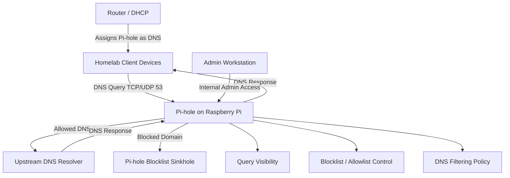
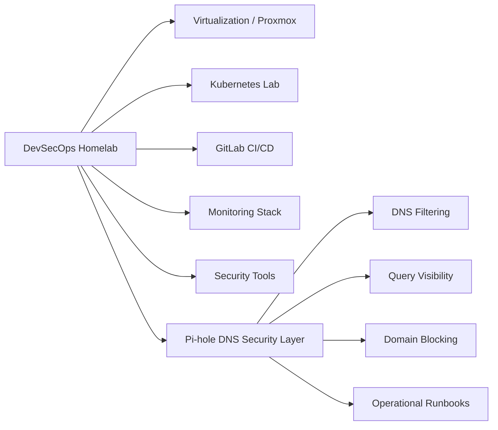
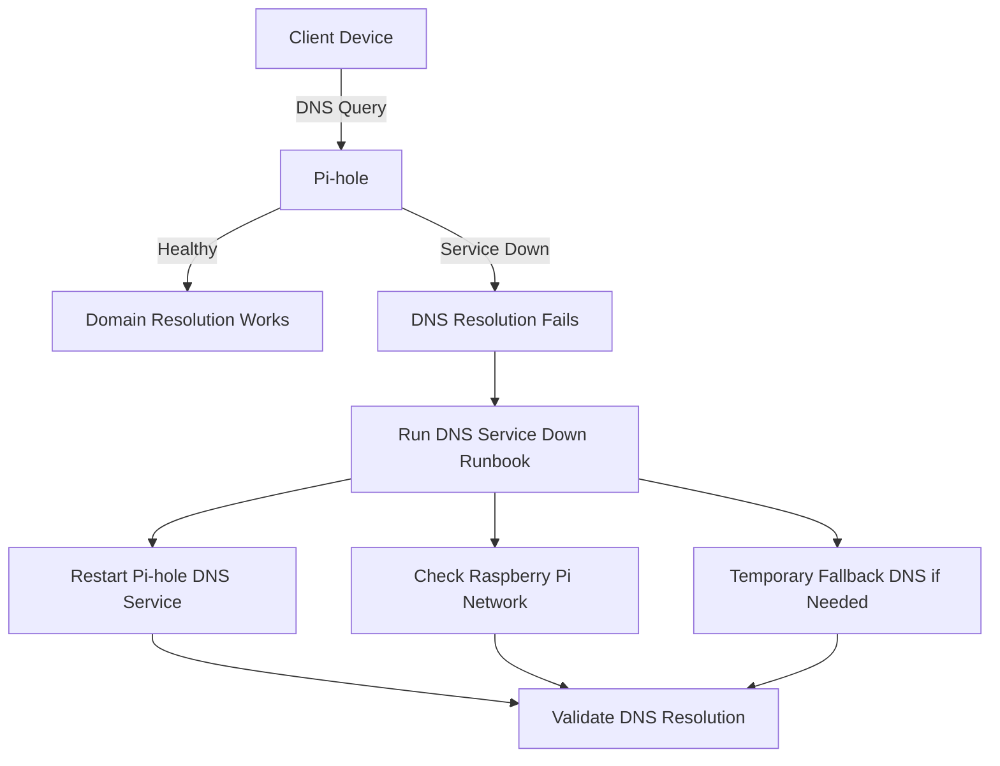
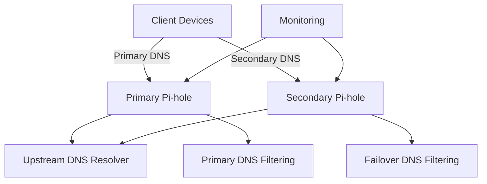

# DNS Security Architecture Diagram

## Purpose

This diagram shows how Pi-hole fits into the broader DevSecOps homelab as the DNS security and filtering layer.

Pi-hole is not the main compute platform. It supports the homelab by providing centralized DNS filtering, query visibility, and domain-level control.

## Current Architecture

## Homelab Context

## Failure Scenario

## Future Improvement: Secondary Pi-hole

## Safety Notes

This diagram intentionally uses generic labels.

It does not expose:

- Real IP addresses
- Client hostnames
- MAC addresses
- VLAN IDs
- Sensitive internal network details
- Full home network topology
